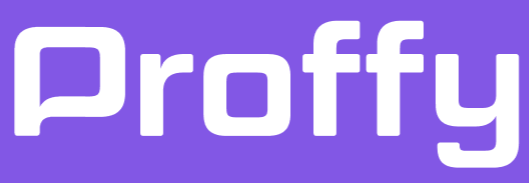
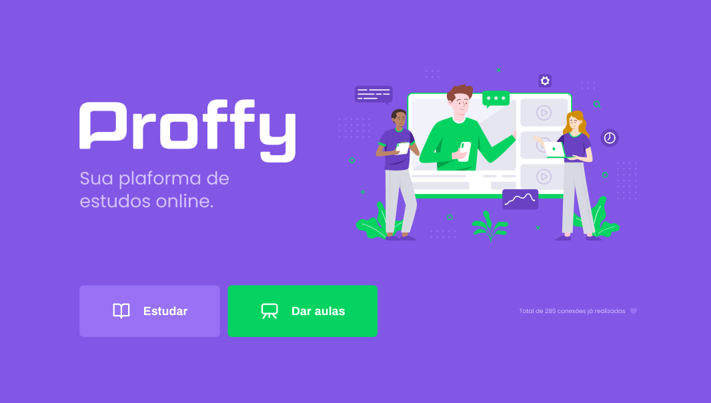

<h1 align="center">
    
</h1>

<h4 align="center"> 
	:heavy_check_mark:  NextLevelWeek 2.0 🚀 Done! :heavy_check_mark:
</h4>
<p align="center">	
	
  
	
  <a href="https://www.linkedin.com/in/bruno-conehero-de-assis-06073a104/">
    
  </a>

  <a aria-label="Completed" href="https://nextlevelweek.com/episodios/omnistack/1/edicao/2">
    </img>
  </a>
  
  <a href="https://github.com/brunocassis/NLW-02/commits/master">
    
  </a>

  
  
</p>

<p align="center">
  <a href="#-nlw">Next Level Week</a>&nbsp;&nbsp;&nbsp;|&nbsp;&nbsp;&nbsp;
  <a href="#-project">Project</a>&nbsp;&nbsp;&nbsp;|&nbsp;&nbsp;&nbsp;
  <a href="#rocket-Technologies">Technologies</a>&nbsp;&nbsp;&nbsp;|&nbsp;&nbsp;&nbsp;
  <a href="#-layout">Layout</a>&nbsp;&nbsp;&nbsp;|&nbsp;&nbsp;&nbsp;
  <a href="#-how-to-use">How to use</a>&nbsp;&nbsp;&nbsp;|&nbsp;&nbsp;&nbsp;
  <a href="#-how-to-contribute">How to contribute</a>&nbsp;&nbsp;&nbsp;|&nbsp;&nbsp;&nbsp;
  <a href="#memo-license">License</a>
</p>

## :information_source: What's Next Level Week?

NLW is a practical week with lots of code, challenges, networking and a single objective: to take you to the next level.

## 💻 Project

Proffy is a project developed during a quarantine world.
It was created with the objective to connect students seeking knowledge and teachers looking to teach and have an extra income.

<h1 align="center">
    
    
</h1>


## :rocket: Technologies

This project was developed with the following technologies:

- [Node.js][nodejs]
- [TypeScript][typescript]
- [React][reactjs]
- [React Native][rn]
- [Expo][expo]

## 🔖 Layout

To access the layout use [Figma](https://www.figma.com/). You can access the [Web](https://www.figma.com/file/GHGS126t7WYjnPZdRKChJF/Proffy-Web) or the [Mobile](https://www.figma.com/file/e33KvgUpFdunXxJjHnK7CG/Proffy-Mobile?node-id=0%3A1) layout. You need an account in order to access it.

## :information_source: How To Use

To clone and run this application, you'll need [Git](https://git-scm.com), [Node.js][nodejs] + [Yarn][yarn] or [npm][npm] installed on your computer.

From your command line:

### Install API 

```bash
# First, clone this repository
$ git clone https://github.com/brunocassis/NLW-02.git

# Go into the repository
$ cd NLW-02/server

# Install dependencies
$ yarn install
# All yarn commands can be made using npm also!

# Start server
$ yarn start

#running on port 3333

```

### Install Front-end

```bash
# Clone this repository
$ git clone https://github.com/brunocassis/NLW-02.git

# Go into the repository
$ cd NLW-02/web

# Install dependencies
$ yarn install

# Run
$ yarn start

# running on port 3000
```

### Install Mobile

```bash
# Clone this repository
$ git clone https://github.com/brunocassis/NLW-02.git

# Go into the repository
$ cd NLW-02/mobile

# Install dependencies
$ yarn install

# Run
$ yarn start

# Expo will open, just scan the qrcode on terminal or expo page

```
## 🤔 How to contribute

-  Make a fork;
-  Create a branch with your feature: `git checkout -b my-feature`;
-  Commit changes: `git commit -m 'feat: My new feature'`;
-  Make a push to your branch: `git push origin my-feature`.

After merging your receipt request to done, you can delete a branch from yours.

## :memo: License

This project is under the MIT license. See the [LICENSE](https://github.com/brunocassis/NLW-02/blob/master/LICENSE) for details.

---

Done by Bruno Assis :wave: [Get in touch!](https://www.linkedin.com/in/bruno-conehero-de-assis-06073a104/)

[npm]: https://www.npmjs.com/
[nodejs]: https://nodejs.org/
[typescript]: https://www.typescriptlang.org/
[expo]: https://expo.io/
[reactjs]: https://reactjs.org
[rn]: https://facebook.github.io/react-native/
[yarn]: https://yarnpkg.com/
